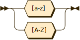
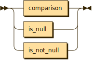
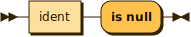

**alpha:**

referenced by:

* ident

**digit:**

referenced by:

* ident

**ident:**

referenced by:

* comparison
* is_not_null
* is_null
* path
* select_projection

**path:**

referenced by:

* reference
* select_stmt

**object_projection:**

referenced by:

* select_projection

**id_projection:**

referenced by:

* select_projection

**select_projection:**

referenced by:

* select_ident_list

**select_ident_list:**

referenced by:

* select_stmt

**where_stmt:**

referenced by:

* select_stmt

**where_condition:**

referenced by:

* where_stmt

**comparison:**

referenced by:

* where_condition

**op:**

referenced by:

* comparison

**value:**

referenced by:

* comparison

**number:**

referenced by:

* value

**string:**

referenced by:

* value

**bool:**

referenced by:

* value

**reference:**

referenced by:

* value

**is_null:**

referenced by:

* where_condition

**is_not_null:**

referenced by:

* where_condition

## 
 generated by [RR - Railroad Diagram Generator][RR]

[RR]: https://www.bottlecaps.de/rr/ui